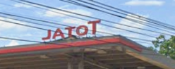

# Nawala sa JATOT

*Category:* OSINT  
*Author:* 0xj4n  
*Description:*

My friend went on a trip somewhere up north, but somehow got lost. He thinks he is somewhere in La Union. All he could tell us was: “Pre, nasa JATOT ako.” He also remembers passing a hotel and restaurant, and seeing another gas station nearby.

*Attachments:* [Challenge image](JATOT.png) · [Challenge description](JATOT.txt)

## 1. Challenge Overview

We are given a photo and a short description. The goal is to identify the hotel and restaurant near the gas station where the friend stopped, using the clues that the place is somewhere in La Union and another gas station is nearby.

## 2. What to Look At

- **JATOT** is a famous meme in the Philippines, which makes the phrase memorable and can send us down a joke or meme-search path.
- For this challenge, the important target is **TOTAL**, the gasoline station brand, rather than a station actually named “JATOT.”
- The area is somewhere in La Union.
- The correct gas station should be near both a hotel and restaurant and another gasoline station.
- The red-marked screenshots point out the relevant Google Maps listings and nearby landmarks.

*Key clue:* Look for a TOTAL station whose map location matches both landmarks from the description: RAMA Hotel and Restaurant and Flying V.

## 3. Approach

I treated “JATOT” as a playful misdirection, then searched Google Maps for TOTAL gas stations in La Union. I compared the candidate listings instead of trusting the first result automatically. One listing's Street View image did not show a gas station, while the next candidate clearly showed a TOTAL station. Satellite view then let me check the nearby hotel and other gas station against the description.

## 4. Solution

### Step 1: Interpret the “JATOT” clue

The included photo uses the word **JATOT**, and JATOT is also a well-known meme in the Philippines. That is a fun distraction, but the challenge is asking us to locate a gasoline station. The intended brand is **TOTAL**.



The screenshot below shows the meme reference included with the challenge:


### Step 2: Search for TOTAL stations in La Union

Search Google Maps for `Total` while viewing La Union. The provided results show a small set of candidates, with two plausible listings near the top to investigate first.


### Step 3: Check the first candidate

The first listing is labeled as a gas station and gives an address on Lubiano Road. However, the Street View image available for that pin shows a tree-covered roadside area and no visible gas station. I cannot tell from the screenshot why Maps lists it as a station; the pin or listing may be inaccurate, or the imagery may not show the business. Either way, this result does not give us enough evidence to confirm it.


### Step 4: Confirm the second candidate

The second listing is also labeled as a gas station. Its Street View image shows a TOTAL station, so this candidate fits the gas-station clue much better.


Now check the same area in satellite view. The TOTAL pin is near **RAMA Hotel and Restaurant**, which matches the hotel clue, and **Flying V**, which matches the nearby-gas-station clue.


### Step 5: Format the answer

The identified location is **RAMA Hotel and Restaurant**. Replace spaces with underscores as the challenge requests:

```text
MLUC{RAMA_Hotel_And_Restaurant}
```

The description’s flag format capitalizes **And**, so preserve that exact capitalization in the answer.