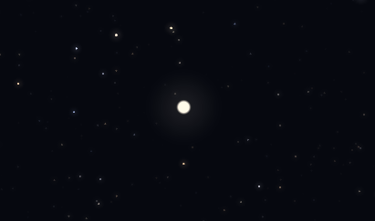
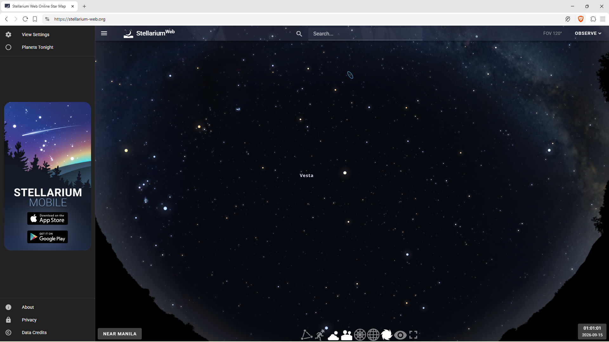
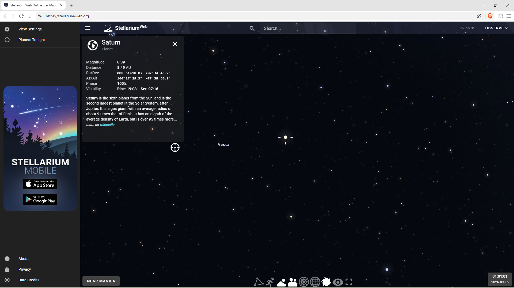

# Out of World

**Category:** OSINT  
**Points:** 100  
**Author:** janus

## Description

> Mortals saw how the Goddess of the Hearth got near this God on September 15, 2026 at 01:01:01. Who might be this God?

**Flag format:** `MLUC{Flag}`

## Solution

The white dots in the picture look like celestial bodies. It is also common for celestial bodies to be named after figures from **Roman mythology**. So, who is the **Goddess of the Hearth**? The answer is **Vesta**.

But how do we determine which celestial body Vesta got close to on **September 15, 2026 at 01:01:01**? We could brute-force this by guessing celestial bodies associated with Roman gods, but there is a more systematic approach.

Since we are given both a **specific date and time** and an image that appears to show a **star map**, this points toward using planetarium software. For this, we can use **Stellarium**.

First, set the date and time in Stellarium to:

- **Date:** September 15, 2026
- **Time:** 01:01:01

Then, search for **Vesta**.

Now, if we compare Stellarium's view with the image from the challenge, we can see that the **large white circle near Vesta** is the celestial body we are looking for.

Identifying that celestial body gives us **Saturn**.

Are you ready for the next trip, little Einstein?

The flag is:

**MLUC{Saturn}**
