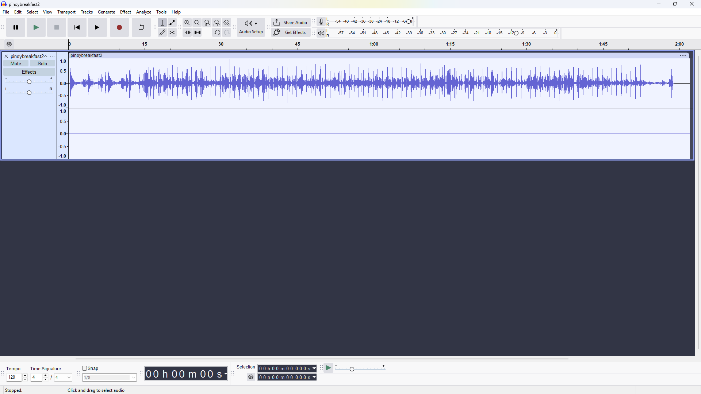
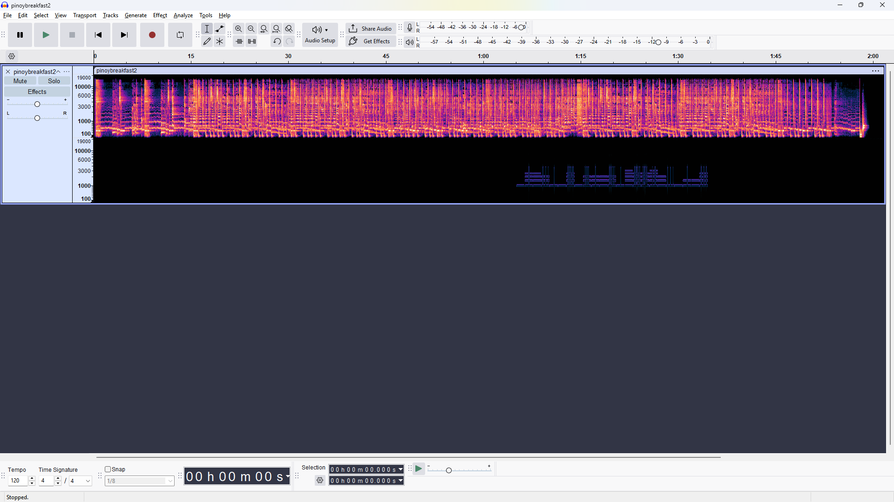
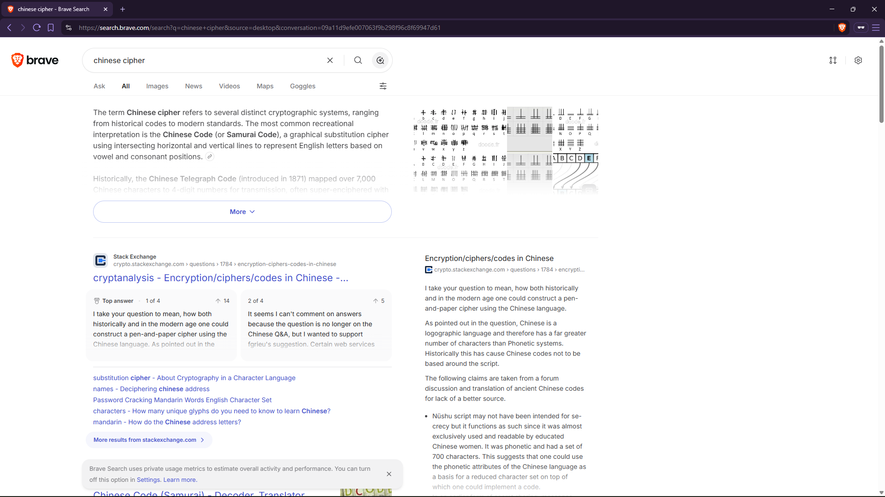
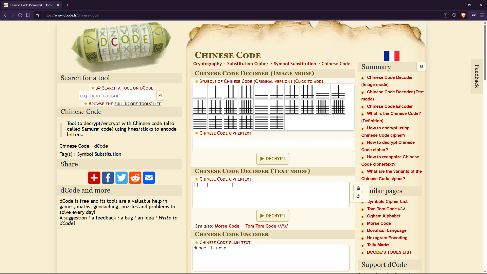
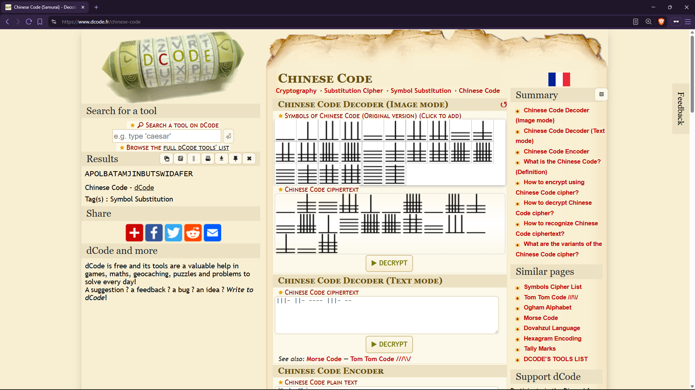

# Pinoy Breakfast 2

**Category:** Miscellaneous  
**Points:** 100  
**Author:** janus

## Description

> That Chinoy malunggay pandesal vendor plays this song every 4AM starting from the western barangay and annoying me, man. And to think it appeared in my supposed-to-be-whimsical dream? Ugh! They stole my right to sleep!

**Flag format:** `MLUC{flag}`

**Attachment:** `pinoybreakfast2.wav`

## Solution

When listening to the song, especially with stereo-supported devices, you may notice that the audio only plays through the **left ear**. This is a reference to:

> plays this song every 4AM starting from the western barangay...

The clue points us toward the **right channel**. To investigate further, I opened `pinoybreakfast2.wav` in **Audacity**. The audio is indeed in stereo, but the **right channel is completely empty**.

Next, click the three-dot menu on the track and select **Spectrogram**. Even though there is nothing audible in the right channel, the spectrogram reveals something hidden in the audio. 

Zooming in makes the pattern much clearer.

The spectrogram contains several lines forming distinct patterns. I also noticed that a particular batch of lines repeats throughout the track. At this point, it is reasonable to assume that the lines represent encoded characters. The challenge is figuring out which cipher is being used. There are quite a few ciphers that use lines or similar visual symbols, so I looked for another clue in the challenge description:

> That Chinoy malunggay pandesal vendor...

If we're clueless about what cipher is being used, we can look at the **etymology or origin** of something used in the challenge description and use that as our next clue. In this case, **"Chinoy"** is a term referring to someone who is Chinese-Filipino. This points us toward something related to **Chinese writing or Chinese-origin ciphers** because there is no Filipino Ciphers anyway. With this clue, we can search for ciphers that use symbols similar to the lines we saw in the spectrogram. Eventually, we find the matching cipher on **dCode**.

We can then manually transcribe the symbols from the Audacity spectrogram and enter them into the corresponding cipher decoder.

After entering the characters, the decoder gives us the plaintext:

Did you capture the flag, Jessica? The flag is: **MLUC{apolbatamjinbutswidafer}**